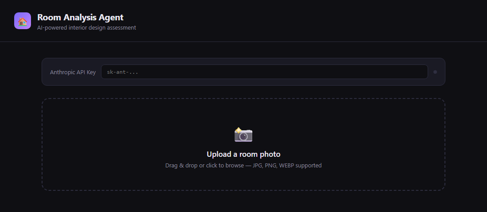

# DesignVerse — AI-Powered Interior Design & Virtual Walkthrough

A browser-based interior design tool that analyzes a room, suggests personalized
design recommendations, and lets users explore customized room concepts through a
virtual walkthrough — all before committing to a real-world redesign.

> Built as a solo project to explore AI-assisted design UX and front-end
> visualization. Runs entirely in the browser — no build step, no server.

---

## ✨ Features

- **Room analysis** — enter or upload room details and get structured design feedback.
- **Personalized recommendations** — style, color palette, and furniture suggestions tailored to the room.
- **Virtual walkthrough** — explore design concepts visually before implementation.
- **Clean, responsive UI** — a dark, modern interface built from scratch with vanilla HTML/CSS/JS.
- **Optional AI integration** — plug in an API key to enable AI-generated analysis (works without one for the core demo).

## 🛠️ Tech Stack

- **HTML5** — structure
- **CSS3** — custom dark theme, layout, and responsive design (no framework)
- **JavaScript (Vanilla)** — interactivity and app logic

## 🚀 Getting Started

No installation or build needed — it's a static site.

1. Clone the repo:
   ```bash
   git clone https://github.com/gillmreet01/DesignVerse.git
   ```
2. Open `room-analysis-agent.html` in any modern browser.
3. (Optional) Paste an AI API key in the top bar to enable live AI analysis.

## 📸 Screenshots

<!-- Add a screenshot or two here — drag an image into this section on GitHub,
     or put files in /images and reference them like: -->
<!--  -->

## 📌 Status

Active prototype — core room-analysis and recommendation flow are working.
Planned next: saved designs and an expanded furniture catalog.

## 👤 Author

**Manreet Gill** — B.Tech CSE, Chandigarh University
[GitHub](https://github.com/gillmreet01) · [LinkedIn](https://www.linkedin.com/in/manreet-gill-9a6662320)
