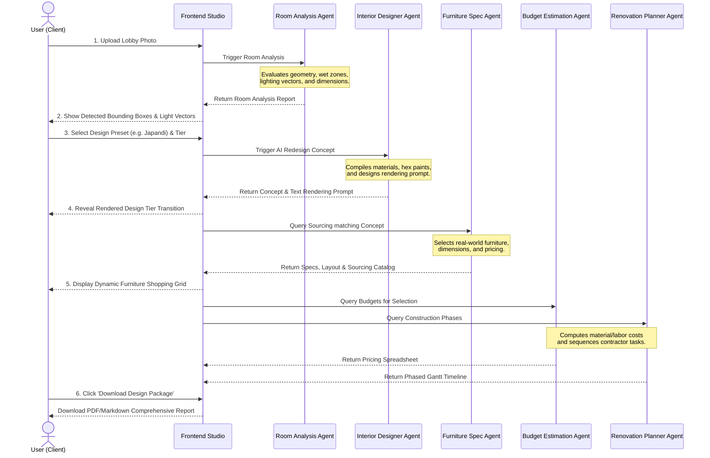

# AI Interior Design Studio: Complete User Flow

This document details the screen-by-screen flow, user actions, and system agent processes for the complete design lifecycle: 
**Upload Photo ➔ AI Analysis ➔ Style Selection ➔ AI Redesign ➔ Furniture Recommendations ➔ Download Report**.

---

## 🗺️ User Flow Architecture

---

## 🖥️ Screen-by-Screen Flow Specifications

### 📁 Step 1: Upload Photo
* **User Interface**: A clean, premium drag-and-drop card featuring a dotted border, an upload icon, and a file selector. Includes sample lobby images for quick testing.
* **User Action**: Drags a lobby photo into the container or selects a local JPEG/PNG file. Clicks **"Run AI Analysis"**.
* **System Process**: Prepares the image metadata and wakes the **Room Analysis Agent**.

### 🔍 Step 2: AI Analysis
* **User Interface**: The uploaded image is displayed with a glowing futuristic overlay:
  - Yellow bounding boxes outline detected doorways and structural columns.
  - A blue box highlights the wet zone (plumbing column).
  - Glowing arrows indicate the direction of natural ambient sunlight.
  - A summary panel displays calculated room height and floor ratios.
* **User Action**: Reviews the detected landmarks. Clicks **"Select Design Style"**.

### 🌿 Step 3: Style Selection
* **User Interface**: A horizontal scrollable deck of cards representing the five style presets:
  - **Modern Minimalist** (Charcoal/white, sharp lines)
  - **Scandinavian** (Blonde wood, light and airy)
  - **Japandi** (Warm earth tones, organic paper lanterns)
  - **Contemporary Luxury** (Walnut wood panels, marble, curved brass)
  - **Warm Organic** (Travertine, textured plaster, terracotta)
* **User Action**: Hovering cards triggers a zoom micro-animation showing color dots. User clicks on their preferred style and hits **"Generate Redesign"**.

### ⚡ Step 4: AI Redesign
* **User Interface**: A loading state overlay showing a pulse animation: *"Designer Agent framing doorways..."* and *"Rendering walnut wood paneling..."*. Then, it reveals the redesigned image of their room.
* **Interaction**: A sliding vertical comparison bar is active, letting the user slide left-and-right to wipe between their original photo and the new AI-generated style render.
* **User Action**: Sweeps the slider to preview the transformation. Clicks **"View Furniture Specs"**.

### 🪑 Step 5: Furniture Recommendations
* **User Interface**: A split screen:
  - **Left**: The redesigned image.
  - **Right**: A clean grid of sourcing cards containing recommended items (e.g. Curved Velvet Sofa, Solid Walnut Coffee Table, Floating Vanity Cabinet). Each card displays the real-world dimensions, fabric finishes, price, and a link button.
* **User Action**: Checks/unchecks items to add them to their shopping cart list. Clicks **"Generate Final Report"**.

### 📄 Step 6: Download Report
* **User Interface**: A complete summary card of the design package, showing:
  - Detected room geometry.
  - Active style (e.g., Japandi) and material list.
  - Total projected budget (itemized list of furniture + estimated labor costs from the Budget Agent).
  - Renovation timeline breakdown (Phases 1–5 from the Renovation Planner).
* **User Action**: Clicks a glowing **"Download Comprehensive PDF Report"** button to export a structured text package.
